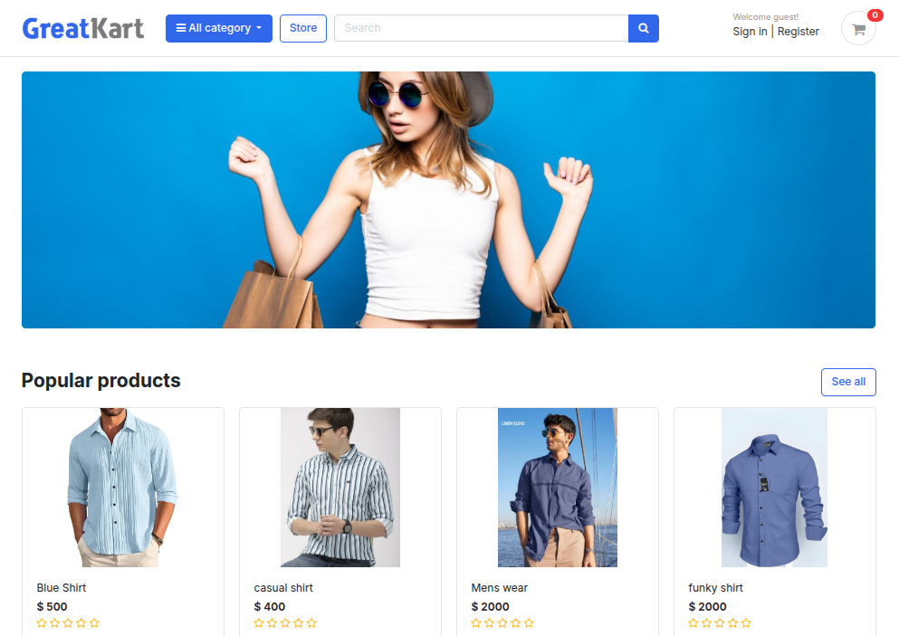
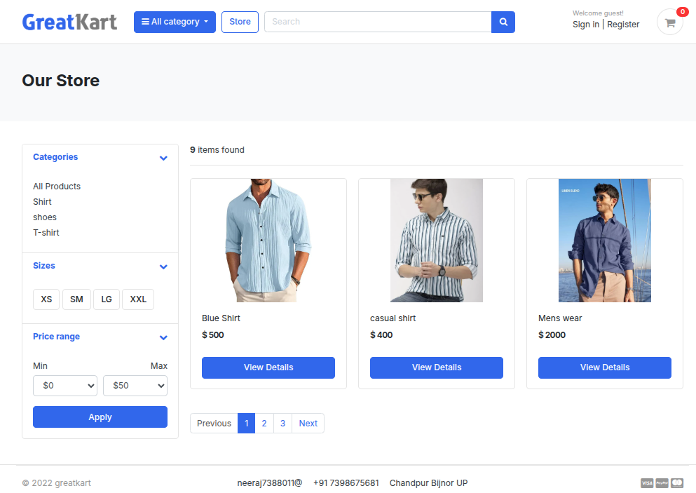
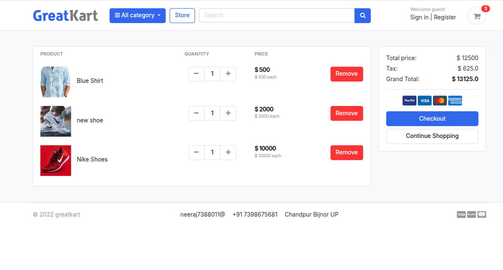
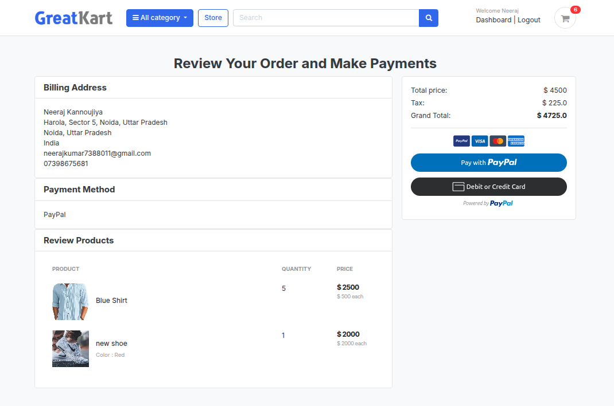

# 🛒 GreatKart – E-Commerce Shopping Platform

**Version**: 1.0
**Developed by**: Neeraj Kumar Kannoujiya
**Internship Organization**: ThinkNext Pvt Ltd
**Project Type**: Internship Project (Full-Stack Web Development)

---

## 📌 Overview

**GreatKart** is a full-stack **e-commerce shopping website** developed using **Django** during my software development internship at **ThinkNext Pvt Ltd**.
The platform enables users to browse products, manage carts, place orders, and complete secure payments through an intuitive and responsive interface.

The project follows **industry-standard software engineering practices**, covering system design, documentation, testing, and deployment.

---

## 🧠 Purpose

This repository contains the complete source code for the **GreatKart** e-commerce application, including:

* User authentication and profile management
* Product catalog and category management
* Shopping cart and order processing
* Secure checkout and payment workflow
* Admin dashboard for product and order control

---

## 🎯 Objectives

| Objective                | Description                                         |
| ------------------------ | --------------------------------------------------- |
| Online Shopping Platform | Enable users to browse and purchase products online |
| Secure Transactions      | Provide safe authentication and payment workflows   |
| Scalable Architecture    | Build a modular Django-based system                 |
| User Experience          | Deliver a responsive and intuitive UI               |

---

## 🧩 Features

### ✅ Core Features

* 👤 **User Authentication**

  * User registration, login, logout
  * Email verification and password reset
* 🛍️ **Product Management**

  * Product listing with categories and variations
  * Product reviews and ratings
* 🛒 **Shopping Cart**

  * Add/remove products
  * Quantity management
* 📦 **Order Management**

  * Order placement and tracking
  * Order history for users
* 💳 **Checkout & Payments**

  * Secure checkout flow
  * Payment integration
* 🧑‍💼 **Admin Dashboard**

  * Product, category, and order management

---

## 🛠️ Tech Stack

| Layer    | Technology                         |
| -------- | ---------------------------------- |
| Frontend | HTML5, CSS3, Bootstrap, JavaScript |
| Backend  | Python, Django                     |
| Database | SQLite3 / MySQL                    |
| Auth     | Django Authentication System       |
| Tools    | Git, GitHub, VS Code               |

---

## 🌀 Project Screenshots

> 📌 *Add screenshots inside a `screenshots/` folder and update paths below.*

### 🏠 Home Page



**Description:**
Displays featured products, categories, and navigation options for users.

---

### 🛍️ Store Page



**Description:**
Allows users to browse products, apply filters, and view product details.

---

### 🛒 Cart Page



**Description:**
Shows selected products with quantity control and total price calculation.

---

### 💳 Checkout Page



**Description:**
Secure checkout interface for order confirmation and payment processing.

---

## 📁 Project Structure

```bash
greatkart/
├── accounts/        # User authentication & profiles
├── carts/           # Shopping cart logic
├── category/        # Product categories
├── orders/          # Order processing
├── store/           # Product catalog
├── templates/       # HTML templates
├── static/          # CSS, JS, fonts
├── greatkart/       # Django settings
├── manage.py
├── requirements.txt
└── README.md
```

---

## 🧰 Prerequisites

Ensure the following are installed:

* ✅ Python 3.8+
* ✅ pip
* ✅ Git
* ✅ Virtualenv (recommended)

---

## 🚀 Local Setup Steps

```bash
# 1. Clone the repository
git clone https://github.com/neerajkumarkannoujiya/greatkart-django.git
cd greatkart-django

# 2. Create and activate virtual environment
python -m venv venv
source venv/bin/activate   # Windows: venv\Scripts\activate

# 3. Install dependencies
pip install -r requirements.txt

# 4. Apply migrations
python manage.py makemigrations
python manage.py migrate

# 5. Create superuser
python manage.py createsuperuser

# 6. Run development server
python manage.py runserver
```

🖥️ Open in browser: **[http://127.0.0.1:8000](http://127.0.0.1:8000)**

---

## 🧪 Testing

* Manual testing for UI and workflows
* Django test framework used for model and view testing

---

## 📈 Learning Outcomes

* Hands-on experience with **Django MVT architecture**
* Real-world understanding of **e-commerce systems**
* Backend development with **authentication, cart, and order logic**
* Practical exposure to **software engineering practices**
* Improved debugging, collaboration, and Git workflow skills

---

## 📄 License

This project is developed for **educational and internship purposes**.

---

## 🤝 Acknowledgment

Special thanks to **ThinkNext Pvt Ltd** mentors for guidance and support during the internship.

---

⭐ *If you like this project, feel free to star the repository!*
